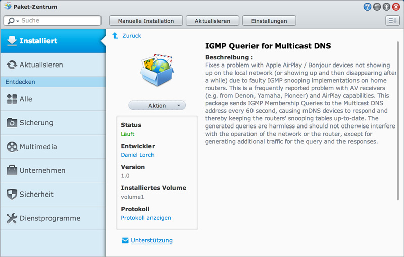

IGMP Querier for Multicast DNS - Synology Package
=================================================

Fixes a problem with Apple AirPlay / Bonjour devices not showing up on the local
network (or showing up and then disappearing after a while) due to faulty IGMP
snooping implementations on home routers. This is a frequently reported problem
with AV receivers (e.g. from Denon, Yamaha, Pioneer) in conjuction with AirPlay.

This package sends IGMP Membership Queries to the Multicast DNS address every 60
second, causing mDNS devices to respond and thereby keeping the routers' snooping
tables up-to-date. The generated queries are harmless and should not otherwise
interfere with the operation of the network or the router, except for generating
additional traffic for the query and the responses.

A Synology Package was chosen because the Synology NAS is the only device that
is running 24/7 on my network and I found it most convenient to implement this
functionality there.

Background
----------

For a detailled explanation, please read Marc Culler's excellent post at:
http://bugs.debian.org/cgi-bin/bugreport.cgi?bug=736641 (the problem described
is not specific to avahi, so you may mentally replace "avahi deamon" by
"Apple Bonjour" while reading the above text).

The implementation here would not have been possible without his analysis
and initial implementation of an IGMP querier daemon. You can find his
implementation here: https://bitbucket.org/marc_culler/querierd/

Installation
------------

Please check http://forum.synology.com/wiki/index.php/What_kind_of_CPU_does_my_NAS_have
for the CPU model applying to your Synology model. Then download the appropriate
package:

| CPU Model                      | Download Link                                                       | Confirmed Working (*) |
| ------------------------------ | ------------------------------------------------------------------- | --------------------- |
| ARM Kirkwood                   | https://s3.amazonaws.com/igmp-querier/IGMPQuerier-armv5tejl-1.0.spk | (please help (*))     |
| ARM Armada                     | https://s3.amazonaws.com/igmp-querier/IGMPQuerier-armv7l-1.0.spk    | YES                   |
| PowerPC MPC85xx PowerQUICC III | https://s3.amazonaws.com/igmp-querier/IGMPQuerier-mpc85xx-1.0.spk   | YES                   |
| PowerPC QorIQ                  | https://s3.amazonaws.com/igmp-querier/IGMPQuerier-qoriq-1.0.spk     | (please help (*))     |
| Intel x86                      | https://s3.amazonaws.com/igmp-querier/IGMPQuerier-x86-1.0.spk       | YES                   |
| Intel x64                      | https://s3.amazonaws.com/igmp-querier/IGMPQuerier-x64-1.0.spk       | (please help (*))     |

(*) While I am able to compile for other platforms, lacking any other models
than mine (DS214se), I cannot test and it on other devices. So if you were
able to run it on your machine, please drop me a line (dlorch@gmail.com)
with your Synology model so I know it's working.

Log in to the administration panel of your Synology NAS, click on `manual
installation' and upload the .spk file. Then follow the installation wizard.

To verify that the installation worked, execute the following command
from a terminal on your computer:

    ping 224.0.0.251

This is the Multicast DNS group. Your AV receiver's IP should respond to
these requests. When you stop the IGMP Querier in Synology, wait a couple
of minutes and the AVR should disappear; when you re-enable the package,
the AVR re-appears.

Development
-----------

Build dependencies:
- libnet-1.0.2a, http://packetfactory.openwall.net/projects/libnet/
- cross compilation tool chain (provided by Synology). Please read the
  Synology DiskStation Manager 3rd-Party Apps Developer Guide:
  http://www.synology.com/en-global/support/third_party_app_int 

For libnet, this is the configure line I used:

    env \
    CC=/usr/local/arm-marvell-linux-gnueabi/bin/arm-marvell-linux-gnueabi-gcc \
    LD=/usr/local/arm-marvell-linux-gnueabi/bin/arm-marvell-linux-gnueabi-ld \
    RANLIB=/usr/local/arm-marvell-linux-gnueabi/bin/arm-marvell-linux-gnueabi-ranlib \
    CFLAGS="-I/usr/local/arm-marvell-linux-gnueabi/arm-marvell-linux-gnueabi/libc/include -mhard-float -mfpu=vfpv3-d16" \
    LDFLAGS="-L/usr/local/arm-marvell-linux-gnueabi/arm-marvell-linux-gnueabi/libc/lib" \
    ac_cv_libnet_endianess=lil \
    ./configure \
      --host=armle-unknown-linux \
      --target=armle-unknown-linux \
      --build=i686-pc-linux \
      --prefix=/usr/local/arm-marvell-linux-gnueabi

Authors
-------

Daniel Lorch <dlorch@gmail.com>

Please see https://github.com/dlorch/igmp-querier
